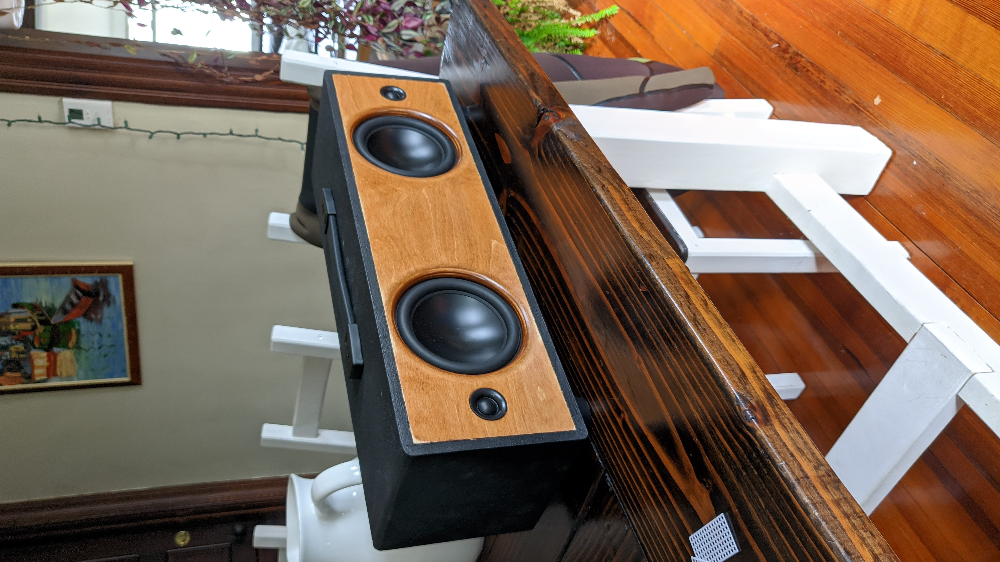
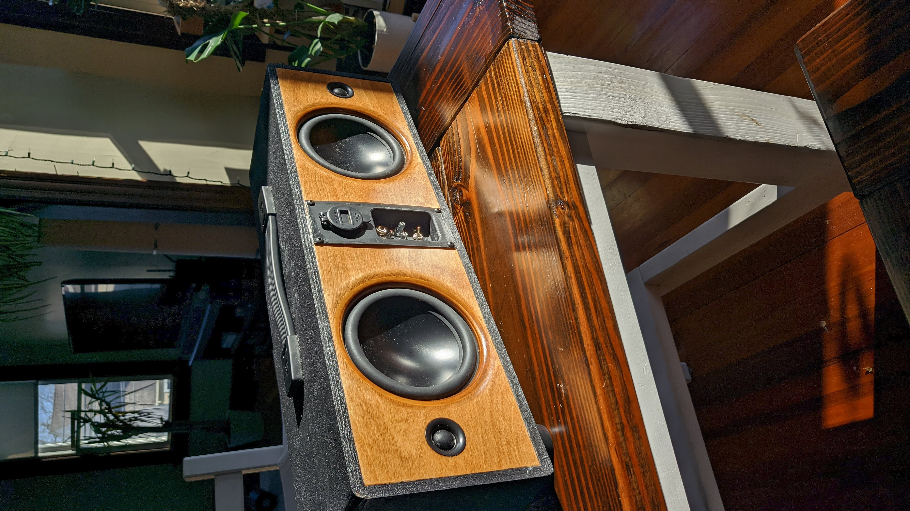
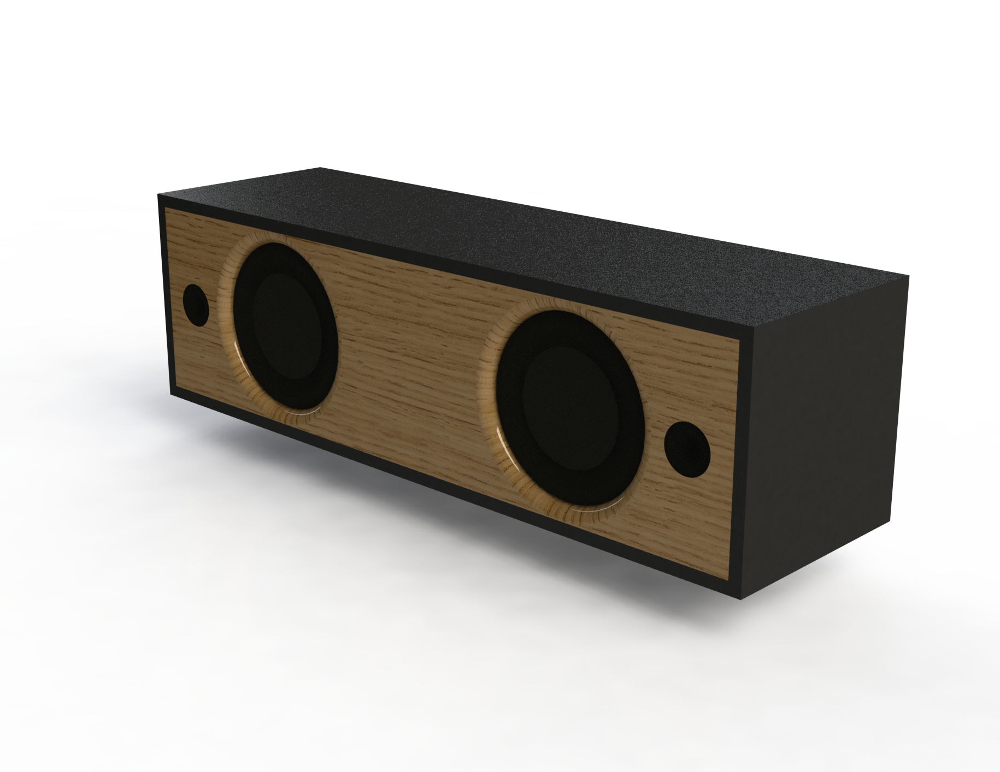
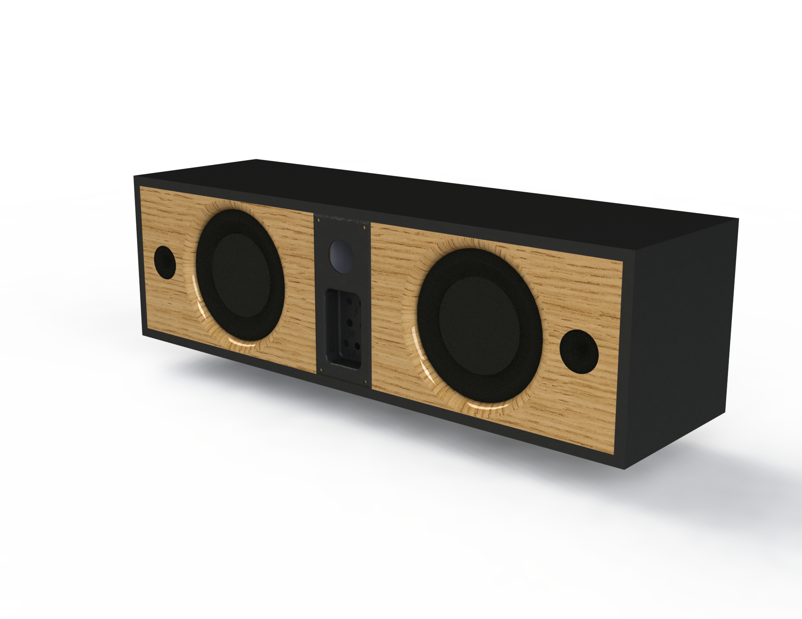
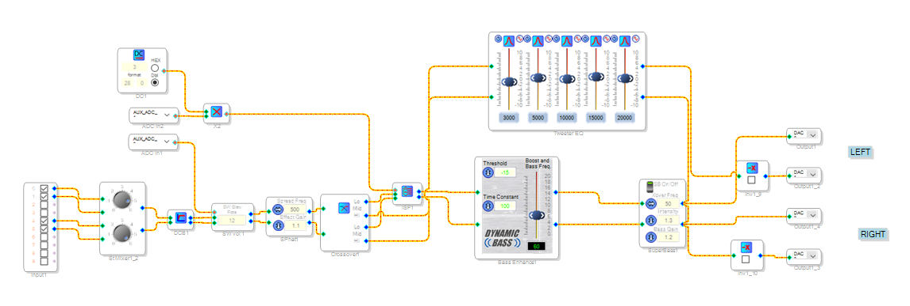

# Das Boominator
A portable speaker build (Boombox)

<figure>
<figcaption aria-hidden="true">Front</figcaption>
</figure>

<figure>
<figcaption aria-hidden="true">Back</figcaption>
</figure>

# Boombox Design
I wanted something highly portable (light and easy to carry) and something that sounded great both indoors and outdoors. After doing far too much research on loudspeaker design, I settled on a stereo bipole arrangement. Inspiration came from a more portable version of the wildly popular (not really) "Boominator" design.
This bipole arrangement creates a true surround experience that excels in an outdoor environment.

# Speaker Selection
With 4 drivers and 4 tweeters, price was a major factor. At around $34, the Dayton ND140-8 was on the low-end of the price spectrum while providing one of the best responses of all mid-range drivers.

# Design
Cabinet and filter design were performed in WinISD. Variable Q was achieved through the use of multiple Linkwitz transforms to boost low-end response. 

<figure>
<figcaption aria-hidden="true">No Linkwitz Transform</figcaption>
</figure>

<figure>
<figcaption aria-hidden="true">With Linkwitz Transform 1</figcaption>
</figure>

<figure>
<figcaption aria-hidden="true">With Linkwitz Transform 2</figcaption>
</figure>

WinISD gave me a target volume to achieve for the enclosure design. All modelling was done in Solidworks to design an enclosure to hit the target volume with measurements I could easily hit on a table saw.

<figure>
<figcaption aria-hidden="true">Render of Front</figcaption>
</figure>

<figure>
<figcaption aria-hidden="true">Render of Back</figcaption>
</figure>

I selected the 4 x 30W JAB4 Wondom Amplifier which includes the ADAU1701 Digital Signal Processing chip that can be programmed in SigmaStudio.
The DSP program was designed to provide some fixed functions (Crossover, Bass Enhancement, Stereo Enhancement, etc.). One of the major advantages of doing DSP was the ability to include a psychoacoustic bass enhancement algorithm that would allow me to make up for a small enclosure size. For this algorithm, you select a crossover point where your natural frequency response drops off and for frequencies below that you play their harmonics with varying gains. To the human ear, the combination of these harmonics sounds identical to the original frequency.
Additionally, the DSP also has variable functions that are controlled by two pots - volume and variable Linkwitz Transform.

<figure>
<figcaption aria-hidden="true">SigmaStudio Program</figcaption>
</figure>